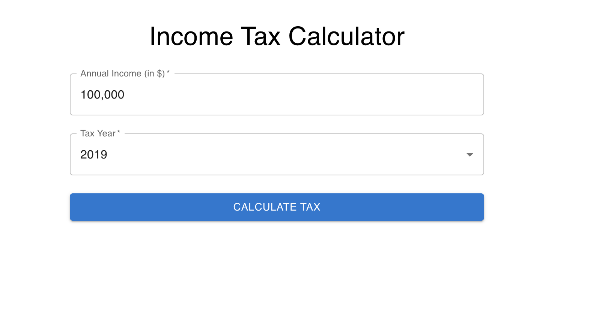

# Tax Calculator Application



## Overview

The Tax Calculator is a web application that calculates the total marginal income tax based on the user’s annual income and selected tax year. It uses a mock API to retrieve tax brackets, applies progressive tax rates, and displays the result formatted with thousand separators. The project is built with React, TypeScript, and Material-UI, and features a scalable architecture with clear separation between business logic, API services, and UI components.


### `npm start`

Runs the app in the development mode.\
Open [http://localhost:3000](http://localhost:3000) to view it in your browser.

The page will reload when you make changes.\
You may also see any lint errors in the console.

### `npm test`

Launches the test runner in the interactive watch mode.\
See the section about [running tests](https://facebook.github.io/create-react-app/docs/running-tests) for more information.

### Setup and Installation

`git clone https://github.com/yourusername/tax-calculator.git`

`npm install`

#### Mock server
```
docker pull ptsdocker16/interview-test-server
docker run --init -p 5001:5001 -it ptsdocker16/interview-test-server
```

### How to Change the Available Tax Years
The Tax Calculator dynamically generates the list of valid tax years from constants. To change the available tax years:

 src folder --> constants.ts

```
export const TAX_YEAR_START = 2019;
export const TAX_YEAR_END = 2025; // Change this to update the range.

```